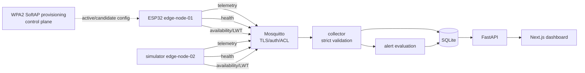
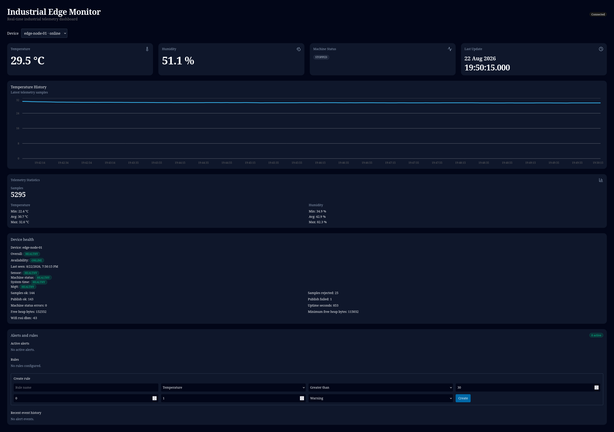
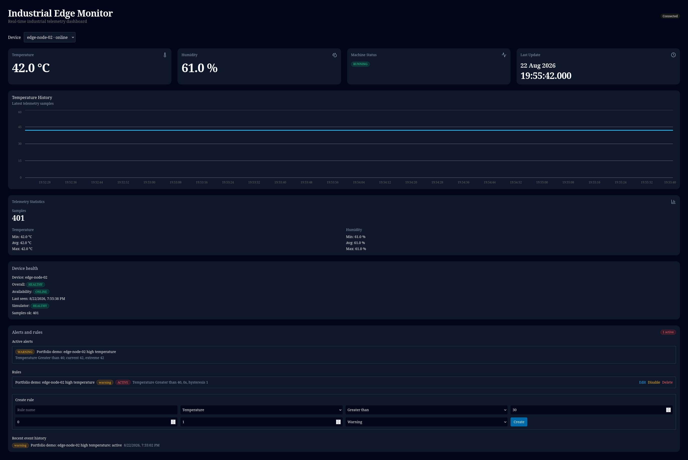

# Industrial Edge Monitor

Industrial Edge Monitor is an end-to-end ESP32/IoT monitoring platform. An ESP32 reads a BME280, publishes validated telemetry and diagnostics over MQTT, and a Python/Next.js stack stores, evaluates and displays data per device.

The project is a portfolio-grade, single-host connected-device reference platform for IoT platform, edge software, connected-device, embedded software and Linux/edge engineering roles. It is intentionally not a SaaS, multi-tenant fleet manager or general cloud platform.

> **Sprint 18 status: IN PROGRESS.** Software, local gates, the operator demo, both physical BME280 recovery procedures and all four real application screenshots are PASS. Final portfolio closure is pending only the future pushed GitHub-hosted CI run and its real `github-actions-green.png`. No `v1.0.0` release is claimed.

## Current capabilities

- Modular ESP-IDF 6.0.2 firmware with BME280 acquisition, SNTP UTC time and authenticated MQTT over TLS.
- Separate per-device telemetry, health and availability topics, with explicit legacy-topic compatibility.
- Strict collector validation for exact-second timezone-aware UTC timestamps, non-coercive finite physical measurements and explicit ASCII device identity domains.
- An opt-in `edge-node-02` simulator with per-device MQTTS topics, retained health/availability, Last Will and configurable deterministic alert values.
- Persistent threshold alerts with dwell time, hysteresis and active/resolved event history.
- Next.js 16 dashboard whose device selector scopes telemetry, statistics, health and alerts together.
- Node.js 24.19.0 frontend baseline shared by local development, CI and the standalone production image.
- Reproducible four-service operational Compose stack, optional fifth demo service, and separate CI jobs for backend, frontend, firmware and containers.

## Architecture



The API and collector reuse one production-like Python image. Mosquitto, both Python processes and the Next.js standalone server share a private Compose network. Only authenticated MQTT TLS `8883`, API `8000` and dashboard `3000` are published to the host.

See the [portfolio diagram](docs/portfolio-architecture.md), detailed [architecture](docs/architecture.md), [Docker and Compose guide](docs/docker.md), [MQTT operations runbook](docs/mqtt-operations.md), [CI guide](docs/ci.md), [backend model](docs/backend.md) and [firmware README](firmware/README.md).

## Quick portfolio demo

The [5–10 minute technical demo](docs/portfolio-demo.md) covers the physical ESP32, an opt-in second device, device isolation, a scoped alert, Last Will offline/recovery, strict payload rejection, TLS/ACLs, provisioning and explicit trade-offs. The simulator never starts in the ordinary stack:

```bash
docker compose up --build --detach --wait --wait-timeout 180
SIMULATOR_TEMPERATURE=42 docker compose --profile demo up --detach simulator
```

The isolated automated acceptance path is:

```bash
scripts/multi-device-demo-smoke.sh
```

## Portfolio screenshots

The following real application frames were visually inspected on 22 August 2026. They contain no visible credentials, setup secrets, tokens, cookies, CSRF values, SSIDs, private keys, provisioning packages or credential-bearing terminals.





The complete four-frame application set, including the two-device selector and Last Will offline transition, remains in the [portfolio demo](docs/portfolio-demo.md). All four required application screenshots are PASS. The future hosted-CI frame remains **IN PROGRESS** and is not claimed. See the [screenshot evidence register](docs/images/portfolio/README.md).

## Docker Compose quick start

Requirements: Docker Engine with the modern Compose and Buildx plugins, plus outbound access for the initial image/dependency build.

Generate local development credentials before starting the secure stack. Add the Docker host LAN hostname or IP to the broker certificate when the ESP32 connects from the LAN:

```bash
git clone <repository>
cd industrial-edge-monitor
test -f .env || cp .env.example .env
test -d .local/mqtt-security || \
  scripts/generate-mqtt-security.sh --lan-host <docker-host-lan-hostname-or-ip>
docker compose up --build -d
docker compose ps
```

Open:

- dashboard: `http://localhost:3000`;
- FastAPI documentation: `http://localhost:8000/docs`;
- API health: `http://localhost:8000/health`;
- MQTT over TLS from the host/LAN: `<docker-host-ip>:8883`.

The generated `.local/mqtt-security/` tree contains secrets, is excluded from Git and Docker build contexts, and must not be copied into images or logs. Existing complete material is left unchanged. `--force` performs only an intentional complete-bundle replacement and refuses unmarked, invalid or symlink targets. Stop or reconfigure any native service already bound to host port `8883`.

Useful lifecycle commands:

```bash
docker compose logs -f
docker compose up --build -d
docker compose down
```

`docker compose down` preserves the named SQLite and Mosquitto volumes. **`docker compose down -v` permanently removes stored telemetry, rules, events, health snapshots and retained broker data.**

The browser-facing `NEXT_PUBLIC_API_URL` is embedded during `docker compose build`. If the dashboard is opened from another machine, set it to a browser-reachable host/LAN URL before building, then rebuild the frontend image. Never use the Compose-only hostname `api` in this variable.

Full installation, configuration and end-to-end procedures are in [docs/setup.md](docs/setup.md). Container concepts, image construction and operations are explained separately in [docs/docker.md](docs/docker.md).

## MQTT topics

For device `edge-node-01`:

```text
industrial/devices/edge-node-01/telemetry
industrial/devices/edge-node-01/health
industrial/devices/edge-node-01/availability
```

The legacy `industrial/telemetry` topic remains supported and is assigned internally to `legacy-device`. That compatibility identity cannot be provisioned or used as an ordinary per-device topic identity. The collector rejects per-device messages when the topic identity and payload `device_id` differ.

## Traditional development workflow

Docker is not required for day-to-day source development. With Python 3.14, Node.js 24.19.0, npm and a TLS/authenticated local Mosquitto service:

```bash
python3 -m venv .venv
source .venv/bin/activate
pip install -r requirements.txt
test -f .env || cp .env.example .env
MQTT_CLIENT_ENABLED=true \
MQTT_USERNAME=collector \
MQTT_PASSWORD_FILE=.local/mqtt-security/clients/collector.password \
MQTT_CLIENT_ID=industrial-edge-collector \
python -m backend.collector.subscriber
```

Run the API and frontend in separate terminals:

```bash
source .venv/bin/activate
uvicorn backend.api.main:app --reload
```

```bash
nvm install
nvm use
cd frontend
test -f .env.local || cp .env.example .env.local
npm ci --ignore-scripts
npm run dev
```

For the explicit second-device demo, start the per-device simulator through its opt-in Compose profile:

```bash
SIMULATOR_TEMPERATURE=42 \
SIMULATOR_HUMIDITY=61 \
docker compose --profile demo up --detach simulator
```

It authenticates as `edge-node-02`, publishes only its `%u`-authorized topics and reports a `simulator` health component rather than pretending to own physical sensors. The no-ESP32 variant cannot prove firmware, BME280, Wi-Fi/SNTP, GPIO or NVS behavior.

The shared `.env` keeps MQTT disabled, so the local API never starts a client or reads the password file. See [docs/setup.md](docs/setup.md) for the complete non-Docker sequence.

## Firmware

```bash
source ~/esp/esp-idf/export.sh
idf.py -C firmware build
idf.py -C firmware -p /dev/ttyUSB0 flash monitor
```

The versioned baseline targets the verified 4 MiB ESP32 and builds one device-independent image. On a blank device, read the one-time setup secret from serial, join the WPA2 `IEM-Setup-*` network and open `http://192.168.4.1`. Wi-Fi and MQTT credentials, public broker CA, identity, telemetry cadence, machine GPIO and maintenance policy are then validated and stored in NVS. The operator-provided Sprint 17 hardware record covers the corrected phone path, provisioning, activation, rollback, credential lifecycle and reset/recovery flows. See [device provisioning](docs/device-provisioning.md) for that record, the destructive migration and local API, and [MQTT operations](docs/mqtt-operations.md) for broker/device procedures. Never connect a 24 V industrial signal directly to an ESP32 GPIO; use suitable conditioning and isolation.

## Quality gates

```bash
source .venv/bin/activate
pytest -q

cd frontend
node --version  # v24.19.0
npm test
npm run lint
npx tsc --noEmit
NEXT_PUBLIC_API_URL=http://127.0.0.1:8000 npm run build
npm audit
npm audit --omit=dev

cd ..

idf.py -C firmware build
docker compose config --quiet
docker compose build
scripts/compose-security-smoke.sh
scripts/mqtt-device-lifecycle-smoke.sh
scripts/multi-device-demo-smoke.sh
```

The GitHub Actions workflow defines separate backend, frontend, firmware and container jobs. The container job generates temporary security material, exercises positive and negative TLS/authentication/ACL cases, rejects an invalid payload without persistence, verifies MQTT-to-API ingestion and checks SQLite persistence across container recreation. It performs no deployment. Sprint 18 GitHub-hosted status remains **IN PROGRESS** until this revision is pushed and the resulting run is inspected. See [docs/ci.md](docs/ci.md).

## Security boundary

The supplied Compose path encrypts MQTT, verifies the broker certificate, requires a distinct username/password identity and enforces least-privilege broker authorization. Device identities can be added, rotated and revoked transactionally, and the ESP32 stores its active/candidate configuration in NVS. The local provisioning page uses authenticated HTTP only inside a unique WPA2 SoftAP; it is not production-grade end-to-end encryption. API/dashboard authentication, hardened HTTPS ingress, managed fleet secrets, Secure Boot and flash/NVS encryption remain absent. Do not expose the stack directly to the public Internet. See the [MQTT security model](docs/mqtt-security.md), [MQTT operations runbook](docs/mqtt-operations.md) and [device provisioning](docs/device-provisioning.md).

## Repository layout

```text
backend/       MQTT collector, persistence, alert engine and FastAPI
docker/        Mosquitto deployment configuration
firmware/      Modular ESP-IDF firmware
frontend/      Next.js monitoring dashboard and production image
docs/          Architecture, setup, API, roadmap and sprint history
tests/         Isolated backend tests
compose.yaml   Reproducible single-host stack
```

Latest completed milestone: **Sprint 17 — Persistent Device Configuration, Local Web Provisioning and Credential Lifecycle**. **Sprint 18 software, local gates, operator demo, both physical BME280 recovery procedures and four application screenshots are verified; final closure remains IN PROGRESS pending hosted CI and its real green-run screenshot.** The project remains single-host and trusted-LAN only, without API/dashboard authentication, HTTPS ingress, Secure Boot, flash/NVS encryption, OTA, store-and-forward, automatic backup or multi-host storage. These are documented trade-offs, not an implicit next sprint.
