# Portfolio Architecture

```mermaid
flowchart LR
    operator[Operator browser]

    subgraph edge[Edge devices]
        esp[ESP32 edge-node-01<br/>BME280 + machine input]
        sim[Python edge-node-02<br/>explicit simulator profile]
    end

    subgraph host[Trusted single-host security boundary]
        broker[Mosquitto<br/>TLS + authentication + default-deny ACL]
        collector[Collector<br/>strict payload validation]
        alerts[Per-device alert evaluation]
        sqlite[(SQLite<br/>telemetry + health + availability<br/>rules + events)]
        api[FastAPI]
        dashboard[Next.js dashboard]

        broker --> collector
        collector --> sqlite
        collector --> alerts
        alerts --> sqlite
        sqlite --> api
        api --> dashboard
    end

    esp -->|MQTTS telemetry| broker
    esp -->|MQTTS retained health| broker
    esp -->|MQTTS availability + LWT| broker
    sim -->|MQTTS telemetry| broker
    sim -->|MQTTS retained health| broker
    sim -->|MQTTS availability + LWT| broker
    operator -->|HTTP on trusted LAN| dashboard

    subgraph control[Provisioning control plane]
        softap[WPA2 SoftAP<br/>authenticated local HTTP]
        nvs[(ESP32 NVS<br/>active / candidate / rollback)]
        lifecycle[Credential lifecycle tooling]
    end

    operator -. local setup .-> softap
    softap -. validated candidate .-> nvs
    nvs -. runtime configuration .-> esp
    lifecycle -. add / rotate / revoke .-> broker
    lifecycle -. controlled package import .-> softap
```

The three MQTT data domains are deliberately separate. Telemetry is a validated measurement stream; health describes internal device components; availability reports reachability and uses an offline Last Will. Provisioning is a separate control plane and does not pass through FastAPI or the dashboard.

The boundary is intentionally a trusted, single-host deployment. MQTT is authenticated and encrypted. Browser/API traffic has no authentication or HTTPS ingress and must not be exposed directly to the Internet. See the detailed [architecture](architecture.md), [security model](mqtt-security.md) and [portfolio demo](portfolio-demo.md).
