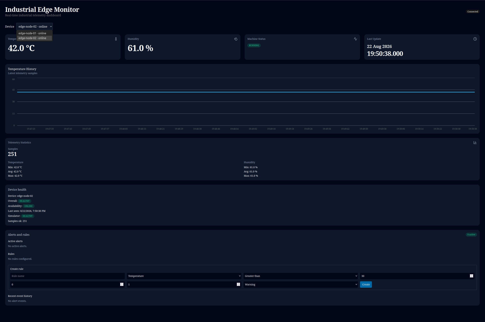
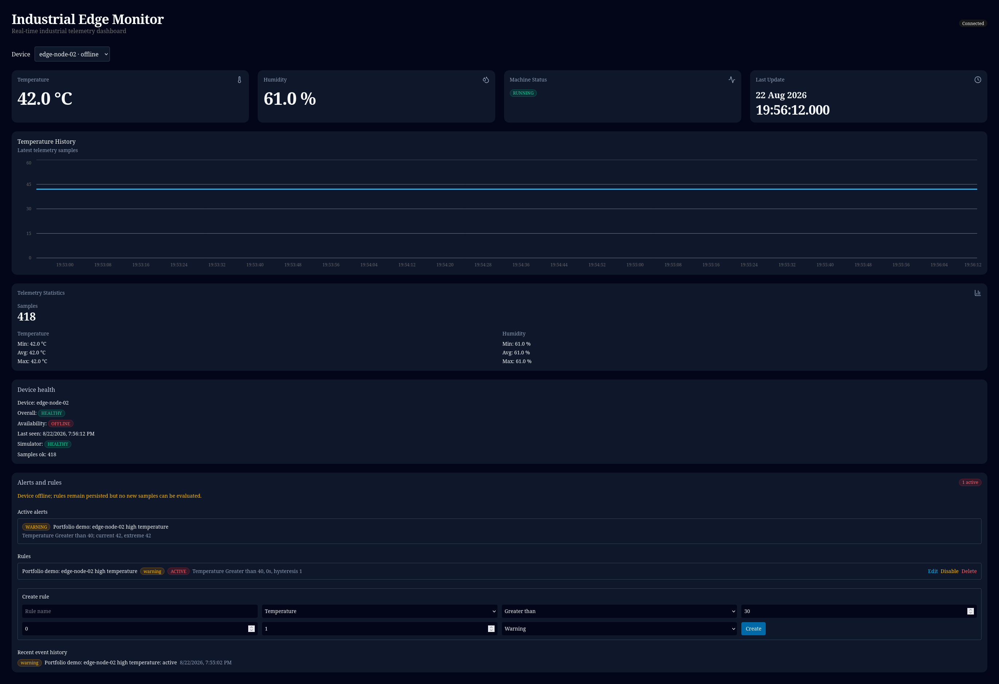

# Portfolio Demo — 5–10 Minutes

## Story and status

Industrial Edge Monitor is a portfolio-grade, single-host connected-device reference platform. The demo follows one physical ESP32/BME280 (`edge-node-01`) and one deliberately limited software device (`edge-node-02`) across measurement, diagnostics, reachability, persistence, alerting and recovery.

Sprint 18 status: **IN PROGRESS**. The operator completed and accepted this demo and both physical sensor-recovery procedures on 22 August 2026, and all four required real application screenshots are verified. Only the future pushed GitHub-hosted workflow and its real `github-actions-green.png` remain pending. Do not describe the simulator as hardware and do not claim external CI for an unpushed revision.

## Operator-provided manual demo evidence — 22 August 2026

Status: **PASS.** This is operator-provided evidence, distinct from local automation.

- The physical `edge-node-01` and opt-in simulated `edge-node-02` were online and both appeared in the dashboard selector.
- Switching the selector kept telemetry, statistics, health and availability isolated. Simulator health exposed only the software `simulator` component.
- A high-temperature rule and active alert applied only to `edge-node-02`; `edge-node-01` remained unaffected.
- SIGKILL caused the retained Last Will to mark only `edge-node-02` offline. Restart returned it online and resumed telemetry.
- SIGTERM published retained offline gracefully. A subsequent restart returned online and resumed telemetry again.

## Visually verified application frames

The PNG structure and pixels were inspected directly. These frames are readable, consistently framed dashboard captures and show no visible password, setup secret, token, cookie, CSRF value, SSID, private key, provisioning package or credential-bearing terminal.






## Prerequisites and safe sequencing

- Docker Engine, Compose and Buildx; ports 3000, 8000 and 8883 free.
- A checkout at the Sprint 18 revision and outbound access for initial builds.
- For the full variant, a provisioned ESP32 `edge-node-01` with BME280 and a broker certificate whose SAN matches the Docker host address.
- Generated credentials must remain under ignored `.local/`; never paste passwords into commands, screenshots or logs.
- The normal operational Compose project must be down before isolated smokes. The smokes publish the same host ports and fail fast rather than stopping an unknown owner.

Do not run a smoke while narrating the demo. First preserve the existing volumes and bring down only this Compose project:

```bash
docker compose --profile demo down
scripts/compose-security-smoke.sh
scripts/mqtt-device-lifecycle-smoke.sh
scripts/multi-device-demo-smoke.sh
docker compose --profile demo ps --all
```

Expected: all three isolated smokes pass; the final project listing has no running service. Each smoke deletes only its unique temporary project, network, volumes and security directory. It never uses the operational SQLite/Mosquitto volumes or `.local/mqtt-security`.

## First setup versus an existing trust domain

From the repository root, create templates and security material only when absent:

```bash
test -f .env || cp .env.example .env
if test ! -d .local/mqtt-security; then
  scripts/generate-mqtt-security.sh --lan-host <docker-host-lan-hostname-or-ip>
fi
docker compose build --pull
scripts/portfolio-demo-preflight.sh <docker-host-lan-hostname-or-ip>
docker compose up --detach --wait --wait-timeout 180
docker compose ps
```

Compose does not need `frontend/.env.local`. If the optional host-side frontend workflow is used separately, create it without overwrite via `test -f frontend/.env.local || cp frontend/.env.example frontend/.env.local`.

Never regenerate or use `--force` merely because a bundle already exists: that would replace the CA, server key/certificate and device passwords. For an existing version-1 bundle, preflight validates its marker/symlink boundary, certificate chain, validity and requested DNS/IP SAN; normalizes only runtime ownership/modes; checks ports 3000/8000/8883; confirms the operational stack is down; confirms the simulator remains profile-gated; and verifies from a non-root container that its password file is readable without printing its contents.

Expected after startup: Mosquitto, API and frontend are healthy; collector is running. `docker compose ps` does not list `simulator`, because the demo profile is opt-in. Open `http://localhost:3000` and keep `http://localhost:8000/docs` available in a second tab.

## Narrated flow

### 1. Purpose and architecture — 45 seconds

Show the [portfolio architecture diagram](portfolio-architecture.md). Explain that ESP-IDF owns acquisition and edge diagnostics; authenticated MQTTS crosses the device boundary; the collector validates and persists; SQLite and the alert engine maintain device-scoped state; FastAPI serves the Next.js selector.

Point out the separate telemetry, health and availability/LWT paths and the separate provisioning control plane. The essential trade-off is deliberate: one trusted host and SQLite make the system understandable and reproducible, but not horizontally scalable or Internet-ready.

### 2. Physical device and live data — 60 seconds

Show the wired ESP32/BME280 without exposing unrelated network details. Select `edge-node-01` and show changing temperature/humidity/history/statistics.

Explain the three statuses:

- machine status describes the external machine input;
- health describes ESP32 components and diagnostic counters;
- availability describes MQTT reachability and freshness.

Expected: `edge-node-01` is online with its own history, health and statistics.

### 3. Start the second device — 60 seconds

Use a deliberately alert-triggering but physically valid value:

```bash
SIMULATOR_TEMPERATURE=42 \
SIMULATOR_HUMIDITY=61 \
SIMULATOR_INTERVAL_SECONDS=2 \
docker compose --profile demo up --detach simulator
```

Expected: `edge-node-02` appears in the selector, becomes online and receives periodic telemetry. Its health contains the component `simulator`; it does not claim a BME280, GPIO, Wi-Fi RSSI or other hardware capability.

Switch between devices. Show that telemetry, history, statistics, health and availability change together with the selector.

### 4. Device-scoped alert — 75 seconds

Create or reuse exactly one controlled rule. This command is idempotent: it reuses only an exact compatible match and fails without changing an incompatible one.

```bash
DEMO_RULE_ID="$(scripts/ensure-demo-alert-rule.py --id-only)"
printf 'Controlled demo rule: %s\n' "$DEMO_RULE_ID"
```

Wait for the next `edge-node-02` sample. Expected: one active warning belongs to `edge-node-02`. Selecting `edge-node-01` shows no alert from this rule and its measurements remain unaffected.

### 5. Abrupt loss and recovery — 60 seconds

```bash
docker compose --profile demo kill --signal SIGKILL simulator
docker compose --profile demo ps --all simulator
```

Expected within a few seconds: the broker publishes the retained Last Will and only `edge-node-02` becomes offline. The service remains stopped (`restart: "no"`, normally exit 137); Compose does not resurrect it. Explain that no graceful cleanup code ran; this is broker-mediated reachability evidence.

Restart it:

```bash
docker compose --profile demo start simulator
```

Expected within one or two configured 2-second intervals: its connect callback republishes retained online/health, periodic samples resume, and `edge-node-01` remains unchanged.

Also demonstrate the distinct graceful path, then return it online for the remaining frames:

```bash
docker compose --profile demo stop simulator
docker compose --profile demo start simulator
```

Expected: SIGTERM lets the simulator publish retained offline before exit; start republishes online and resumes telemetry. This is different evidence from the SIGKILL/LWT path.

### 6. Invalid payload and layered security — 60 seconds

Refer to the already completed pre-demo security smoke; do not start it while host ports are occupied. Its proof is deterministic and checks database/API state, not only a log line: a naive timestamp, numeric string and boolean metric are rejected and no telemetry row exists for that device. It also checks CA and hostname verification, anonymous/bad-password denial, positive and negative least-privilege ACL paths, retained state, LWT and persistence.

Explain the identity layers: device username drives the broker `%u` ACL, topic includes the same ASCII `device_id`, and the collector checks topic/payload equality before schema validation.

### 7. Provisioning, containers and CI — 60 seconds

Show only the redacted provisioning page if safe. Explain active/candidate/rollback configuration in NVS and transactional add/rotate/revoke tooling. Passwords are generated outside Git, passed by protected files and not logged.

Show `compose.yaml` and `.github/workflows/ci.yml`: non-root API/collector/frontend images, isolated MQTT and SQLite volumes, backend/frontend/firmware/container jobs. State plainly that the current Sprint 18 GitHub-hosted result remains pending until this revision is pushed.

### 8. Trade-offs and conclusion — 45 seconds

Close with explicit limits: SQLite and named volumes are single-host; dashboard/API use trusted-LAN HTTP without authentication or HTTPS ingress; provisioning HTTP relies on the unique WPA2 SoftAP rather than application TLS; NVS is not encrypted; there is no Secure Boot, OTA, store-and-forward, automatic backup or multi-host storage.

These are conscious portfolio boundaries. The evidence is aimed at IoT platform, edge software, connected-device, embedded IoT/software and Linux/edge roles—not SaaS, tenancy or fleet management.

## Automated multi-device acceptance

Run this independently of development data and credentials:

```bash
scripts/multi-device-demo-smoke.sh
```

Expected output ends with `Isolated multi-device demo smoke passed.` It generates a temporary security bundle and unique Compose project, proves separate registry/history/statistics/health, activates an `edge-node-02`-only alert, verifies SIGKILL/LWT isolation and restart, checks non-root runtime/log hygiene, then deletes only its own containers, network, volumes and temporary bundle.

## Non-destructive cleanup

For the operator demo, disable only the controlled demo rule and stop only this project:

```bash
curl --fail --silent --show-error -X PATCH \
  -H 'Content-Type: application/json' \
  -d '{"enabled":false}' \
  "http://127.0.0.1:8000/alert-rules/$DEMO_RULE_ID"
docker compose --profile demo stop simulator
docker compose down
```

The exact rule remains reusable rather than creating archived duplicates; an active event for that rule is preserved and resolved with `rule_disabled`, while every other rule and event remains untouched. On the next demo, `ensure-demo-alert-rule.py` re-enables the same compatible ID. `down` preserves named volumes and the local credential bundle. Do not add `--volumes` unless destructive data removal is separately intended and approved.

## Variant without ESP32

Run the setup and opt-in simulator exactly as above. This proves one per-device TLS client, payload validation, health, availability/LWT, persistence and alerting. Use `scripts/multi-device-demo-smoke.sh` for automated isolation between two logical device identities.

Limit: this variant does **not** prove ESP-IDF execution, BME280 measurement, GPIO machine status, Wi-Fi/SNTP behavior, physical provisioning/NVS, sensor failure/recovery or real-device TLS. Say so during the demo.

## Troubleshooting

| Symptom | Check |
| --- | --- |
| Simulator absent | Include `--profile demo`; ordinary `docker compose up` intentionally excludes it. |
| TLS hostname error | Inspect `openssl x509 -in .local/mqtt-security/server/server.crt -noout -ext subjectAltName`. Do not overwrite the trust domain during demo prep; plan an explicit coordinated certificate/CA rotation if the SAN is wrong. |
| Simulator exits | Inspect `docker compose --profile demo logs simulator mqtt collector` for categorized failures; logs should not contain secrets. |
| Device remains offline | Confirm retained online reached the collector and that fresh telemetry/health advances `last_seen`. |
| Alert does not activate | Create the rule before the next sample; confirm `SIMULATOR_TEMPERATURE` exceeds the threshold and the selected device is `edge-node-02`. |
| Port conflict | `scripts/check-host-ports.py 3000 8000 8883` reports the conflict and changes nothing. Inspect the exact owner and stop/reconfigure only that process. |

The completed operator-provided sensor evidence is recorded in the [BME280 failure and recovery checklist](sensor-failure-runbook.md). Screenshot inspection and the remaining filename/hosted-CI blockers are tracked in the [screenshot evidence register](images/portfolio/README.md).
